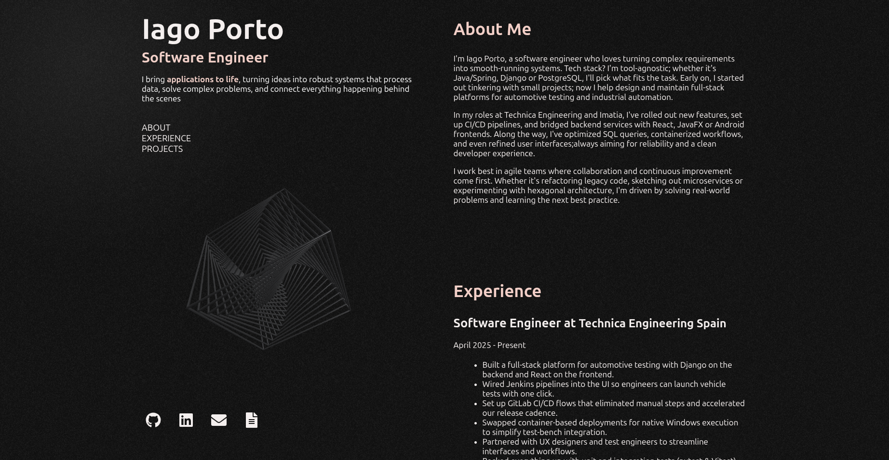

# Portfolio Website

[](https://reactjs.org)
[](https://developer.mozilla.org/docs/Web/JavaScript)
[](https://opensource.org/licenses/MIT)

A personal portfolio website built using **React**.

## Overview

This repository hosts my portfolio website, showcasing my projects and skills with a clean, modern design.



## Features

- **Responsive Design:** Adapts seamlessly to various screen sizes.
- **Component-Based Architecture:** Built with reusable React components.
- **Optimized Build:** Fast development and production builds.
- **Automated Quality Checks:** Formatting, linting, and testing steps are enforced via GitHub Actions.

## Installation

1. **Clone the Repository:**

   ```bash
   git clone https://github.com/IagoPorto/portfolio.git
   cd portfolio
   ```
   
2. **Install Dependencies**:
  
    ```bash
    npm install
    ```

3. **Run the Development Server**:

   ```bash
   npm run dev
   ```

## Scripts
The following commands are available:

| Command	| Description|
|-----------|------------|
| npm run format:check	| Check code formatting with Prettier|
| npm run format:fix	| Automatically fix code formatting|
| npm run lint:check	| Check code for linting errors|
| npm run lint:fix	| Automatically fix linting issues|
| npm run test:coverage	| Run tests and display code coverage report|

## Continuous Integration
GitHub Actions are configured to run automatically on each Pull Request. These steps include:

- format:check
- lint:check
- test:coverage

This ensures that all code contributions meet the project's standards before being merged.


## Contributions

Contributions are welcome! If you have ideas for improvements or bug fixes, please open an issue or submit a pull request following standard best practices.

## License

This project is licensed under the MIT License. See the LICENSE file for details.
